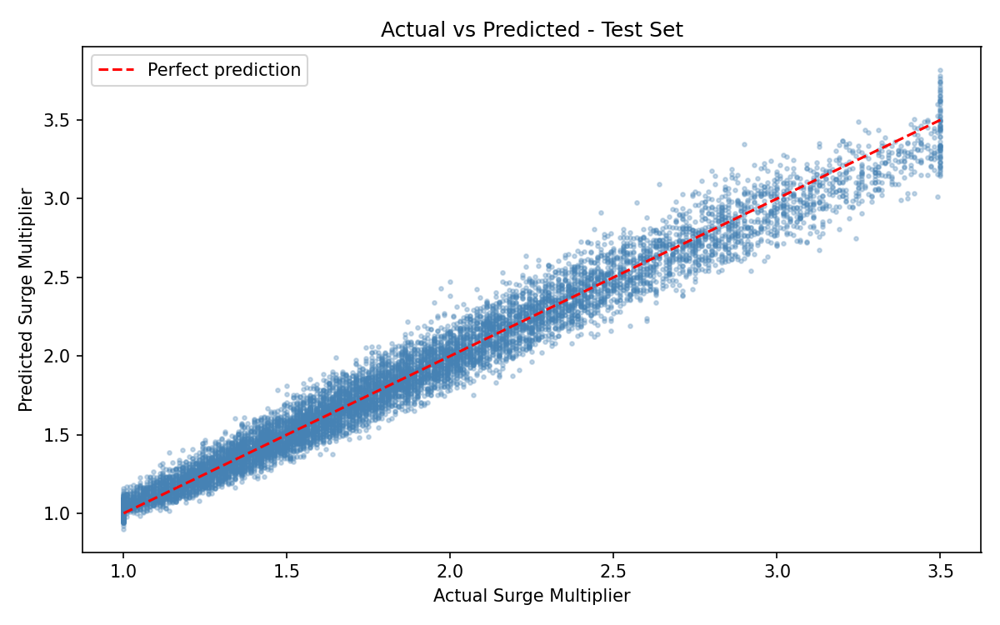
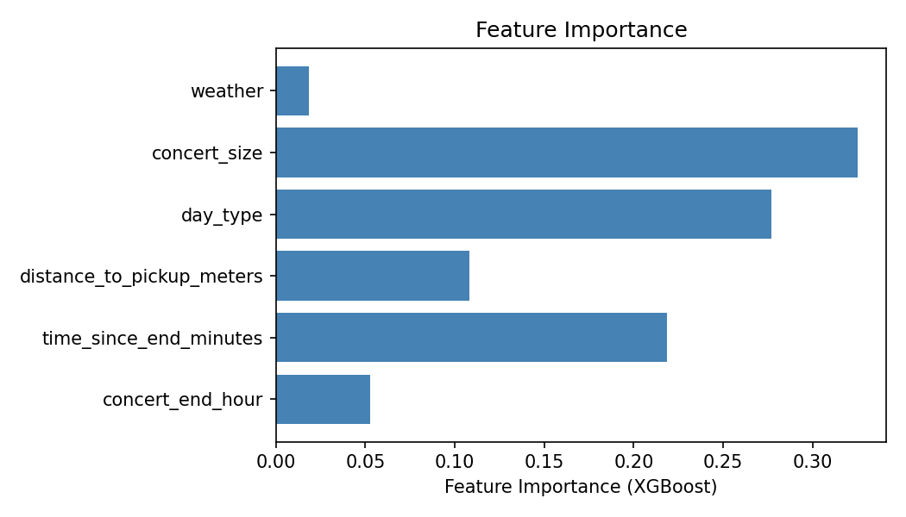
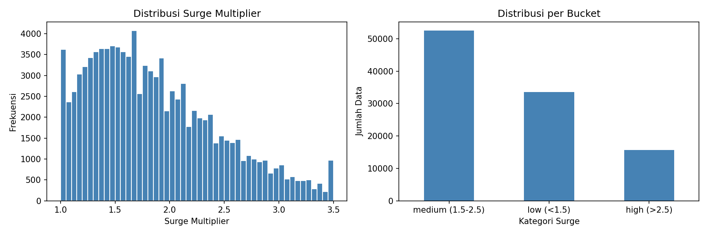

# GBK Post-Concert Transport Optimizer


[](https://huggingface.co/spaces/kentarotaro/gbk-transport-optimizer)


---

## Ikhtisar Proyek

Setiap kali konser besar selesai digelar di Gelora Bung Karno (GBK), puluhan ribu penonton menghadapi masalah yang sama: lonjakan harga ojol yang drastis dan kemacetan yang mengular di seluruh titik keluar kawasan. Pada kondisi seperti ini, keputusan yang tampak sederhana — "mau pulang naik apa?" — sebenarnya menyimpan banyak variabel yang sulit dihitung secara manual: seberapa besar surge saat ini, pintu keluar mana yang paling dekat dengan halte TransJakarta, dan apakah lebih hemat jalan kaki dulu beberapa menit sebelum memesan ojol?

Proyek ini hadir sebagai jawaban atas persoalan tersebut. GBK Post-Concert Transport Optimizer adalah aplikasi web berbasis MVP yang membantu pengguna membuat keputusan transportasi yang lebih cerdas, langsung dari ponsel mereka di tengah keramaian pasca-konser. Sistem ini menggabungkan prediksi harga berbasis machine learning dengan pencarian rute jalan kaki yang optimal, kemudian menyajikan tiga rekomendasi terstruktur kepada pengguna:

- **Opsi A — Ojol Langsung:** Pesan ojol dari gerbang terdekat sekarang, dengan estimasi harga setelah surge multiplier.
- **Opsi B — Jalan Dulu ke Titik Alternatif:** Jalan kaki ke gerbang GBK lain yang memiliki estimasi surge lebih rendah, kemudian pesan ojol dari sana.
- **Opsi C — TransJakarta:** Manfaatkan halte Transjakarta terdekat sebagai alternatif yang bebas dari surge pricing.

---

## Alur Kerja Sistem

Sistem bekerja melalui dua komponen utama yang terintegrasi: model prediksi harga dan mesin pencari rute.

### 1. Prediksi Surge Multiplier dengan XGBoost

Saat pengguna memasukkan kondisi saat ini — seperti waktu, jumlah penonton, kondisi cuaca, dan nama konser — data tersebut diproses oleh pipeline inferensi yang memanggil model XGBoost Regressor yang telah dilatih sebelumnya (`surge_predictor.pkl`). Model ini memprediksi nilai surge multiplier (misalnya, `2.3x`) yang kemudian dikalikan dengan tarif dasar ojol untuk menghasilkan estimasi harga akhir.

Sebelum data masuk ke model, fitur kategorikal (seperti nama area atau kondisi cuaca) dienkode menggunakan `encoder.pkl`, sementara fitur numerik dinormalisasi menggunakan `scaler.pkl`. Urutan kolom dipertahankan secara ketat sesuai `feature_columns.json` untuk memastikan konsistensi inferensi dengan data pelatihan.

### 2. Pencarian Rute Jalan Kaki dengan NetworkX dan Algoritma A*

Kawasan GBK dimodelkan sebagai graf berbobot menggunakan NetworkX, di mana setiap node mewakili gerbang atau titik penting (pintu masuk, halte TransJakarta, titik drop-off ojol), dan setiap edge berbobot berdasarkan estimasi jarak jalan kaki dalam meter. Ketika sistem perlu menentukan rute optimal dari satu gerbang ke gerbang lain, algoritma A* dijalankan pada graf ini untuk menemukan jalur dengan total jarak terpendek.

Hasil pencarian rute kemudian dikombinasikan dengan prediksi surge dari XGBoost untuk menghitung total biaya dan waktu tempuh masing-masing opsi transportasi, sebelum akhirnya diranking dan ditampilkan melalui antarmuka Gradio.

---

## Evaluasi Model

Performa model diukur menggunakan metrik standar regresi — termasuk MAE, RMSE, dan R-squared — pada data validasi yang belum pernah dilihat model selama pelatihan. Visualisasi berikut dirender menggunakan gaya `xkcd` dari Matplotlib, yang sengaja dipilih untuk membuat data lebih mudah dicerna secara visual tanpa mengurangi keakuratan informasi yang disajikan.

### Perbandingan Baseline vs. Model Tertuning


Grafik ini membandingkan performa model baseline (XGBoost dengan hyperparameter default) terhadap model yang telah melalui proses tuning. Penurunan error dan peningkatan skor R-squared terlihat secara konsisten setelah tuning dilakukan.

### Nilai Aktual vs. Nilai Prediksi



Sebaran titik data pada grafik ini menunjukkan seberapa dekat prediksi model terhadap nilai surge aktual. Semakin rapat titik-titik mendekati garis diagonal ideal, semakin baik kemampuan generalisasi model.

### Pentingnya Fitur (Feature Importance)



Visualisasi ini menampilkan kontribusi relatif setiap fitur terhadap keputusan prediksi model. Fitur seperti waktu pasca-konser, jumlah estimasi penonton, dan kondisi cuaca secara konsisten muncul sebagai penentu utama nilai surge.

### Distribusi Surge dalam Data Pelatihan



Grafik distribusi ini memberikan gambaran tentang skewness dan rentang nilai surge dalam dataset, yang menjadi dasar pertimbangan dalam proses feature engineering dan pemilihan metrik evaluasi.

---

## Struktur Repositori

```
gbk-transport-optimizer/
|
|-- app/                        # Logika aplikasi dan antarmuka pengguna
|   |-- __init__.py
|   |-- gradio_ui.py            # Definisi komponen dan layout antarmuka Gradio
|   |-- inference.py            # Pipeline inferensi: load model, prediksi, routing
|   |-- main.py                 # Titik masuk aplikasi (entry point)
|   `-- schemas.py              # Struktur data input/output (Pydantic atau dataclass)
|
|-- data/                       # Dataset dan file pemetaan
|   |-- raw/                    # Data mentah sebelum preprocessing
|   |-- processed/              # Data setelah feature engineering
|   |-- train/                  # Split data pelatihan
|   |-- val/                    # Split data validasi
|   |-- test/                   # Split data pengujian
|   `-- destinations.json       # Pemetaan statis titik tujuan dan jarak antar gerbang GBK
|
|-- models/                     # Artefak model dan visualisasi hasil evaluasi
|   |-- surge_predictor.pkl     # Model XGBoost Regressor terlatih
|   |-- encoder.pkl             # Label/Ordinal encoder untuk fitur kategorikal
|   |-- scaler.pkl              # Scaler untuk normalisasi fitur numerik
|   |-- feature_columns.json    # Urutan kolom fitur yang digunakan saat pelatihan
|   |-- eval_results.json       # Metrik evaluasi numerik (MAE, RMSE, R2)
|   |-- baseline_vs_tuned.png   # Grafik perbandingan performa model
|   |-- actual_vs_predicted.png # Grafik nilai aktual vs. prediksi
|   |-- feature_importance.png  # Grafik kontribusi fitur
|   `-- eda_surge_distribution.png  # Grafik distribusi surge dari EDA
|
|-- notebooks/                  # Jupyter Notebooks untuk eksplorasi dan pelatihan
|   |-- 01_data_exploration.ipynb
|   |-- 02_feature_engineering.ipynb
|   |-- 03_model_training.ipynb
|   `-- 04_evaluation.ipynb
|
|-- src/                        # Modul sumber daya yang dapat digunakan ulang
|   |-- evaluation/             # Skrip kalkulasi metrik evaluasi
|   |-- preprocessing/          # Transformasi dan pipeline data
|   |-- training/               # Skrip pelatihan dan hyperparameter tuning
|   `-- utils/                  # Fungsi pembantu umum
|
|-- app.py                      # Entry point utama untuk deployment di Hugging Face Spaces
|-- requirements.txt            # Dependensi Python proyek
`-- README.md                   # Dokumentasi proyek ini
```

---

## Panduan Instalasi Lokal

Pastikan Python 3.10 atau versi lebih baru telah terpasang di sistem sebelum memulai.

**1. Clone repositori**

```bash
git clone https://github.com/kentarotaro/gbk-transport-optimizer.git
cd gbk-transport-optimizer
```

**2. Buat dan aktifkan virtual environment (direkomendasikan)**

```bash
python -m venv .venv

# Windows
.venv\Scripts\activate

# macOS / Linux
source .venv/bin/activate
```

**3. Pasang seluruh dependensi**

```bash
pip install -r requirements.txt
```

**4. Jalankan aplikasi**

```bash
python app.py
```

Setelah perintah di atas dieksekusi, antarmuka Gradio akan tersedia secara lokal. Salin URL yang ditampilkan di terminal (biasanya `http://127.0.0.1:7860`) dan buka di browser.

---

## Batasan Sistem MVP dan Rencana Pengembangan

### Batasan yang Diketahui

Dalam versi MVP ini, pemetaan jarak antar gerbang GBK dan titik tujuan sekitarnya sepenuhnya bergantung pada file `data/destinations.json` yang bersifat statis. Data jarak di dalam file ini merupakan nilai proksi yang dikurasi secara manual, bukan perhitungan berbasis rute aktual di lapangan. Akibatnya, estimasi waktu jalan kaki dan perhitungan rute A* yang dihasilkan sistem merupakan pendekatan, bukan representasi kondisi lapangan yang sesungguhnya.

Selain itu, model prediksi surge saat ini dilatih pada dataset sintetis yang direkayasa berdasarkan pola lonjakan harga yang bersifat umum, bukan data historis transaksi ojol yang sebenarnya. Akurasi prediksi pada kondisi konser yang sangat spesifik masih perlu divalidasi lebih lanjut.

### Rencana Pengembangan

Beberapa peningkatan yang direncanakan untuk iterasi berikutnya mencakup:

- **Integrasi Google Maps Distance Matrix API** — menggantikan file `destinations.json` statis dengan kalkulasi jarak dan durasi perjalanan yang dinamis dan berbasis kondisi lalu lintas aktual.
- **Data cuaca real-time** — menghubungkan sistem ke API cuaca terbuka (seperti Open-Meteo atau BMKG) untuk menyertakan kondisi cuaca saat inferensi, bukan hanya sebagai input manual dari pengguna.
- **Koleksi data historis** — membangun pipeline untuk mengumpulkan dan memvalidasi data surge dari sumber yang lebih representatif guna meningkatkan kualitas pelatihan model.
- **Notifikasi berbasis waktu** — menambahkan fitur yang menginformasikan pengguna kapan waktu optimal untuk memesan ojol berdasarkan proyeksi penurunan surge.

---

## Lisensi

Proyek ini dikembangkan sebagai bagian dari program magang di OmahTI. Seluruh kode dan aset dalam repositori ini bersifat terbuka untuk keperluan edukasi dan pengembangan lebih lanjut.
